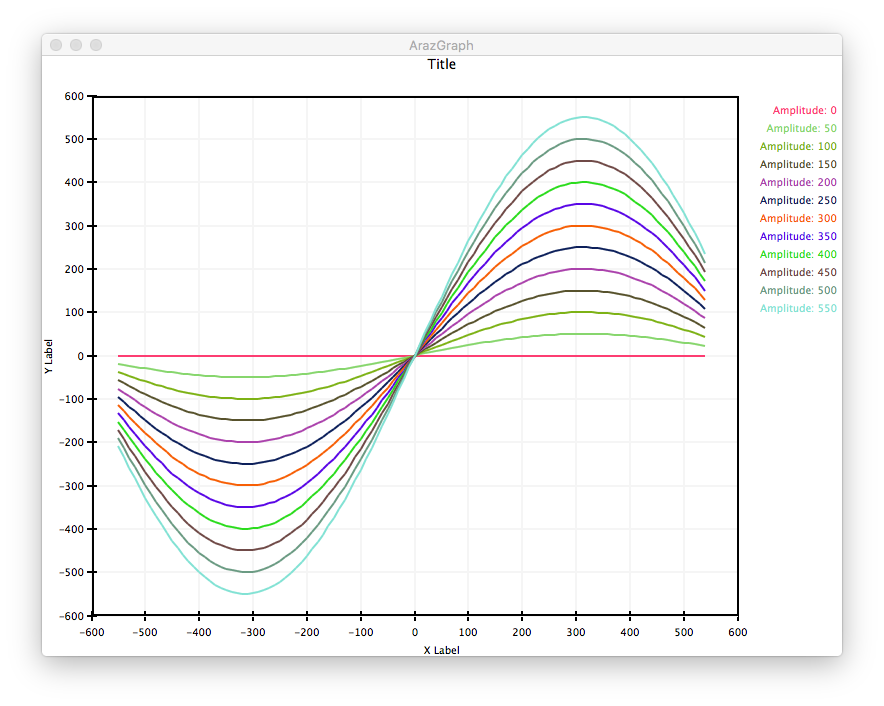

# ArazGraph

This is a simple data plotter [juce](https://github.com/julianstorer/JUCE)::Component with auto-scaling axes, organized as a JUCE module.

## Requirements

Tested with JUCE >4.0.0, might work with >3.0.0 as well.

## Example

```
MainContentComponent::MainContentComponent()
{
    addAndMakeVisible(graph);
    
    Random rnd;
    
    for (int j = 000; j <= 550; j += 50)
    {
        ArazGraphDataset* leftEarData = new ArazGraphDataset("Amplitude: "+String(j),
                                                             Colour::fromRGB(rnd.nextFloat() * 0xff,
                                                                             rnd.nextFloat() * 0xff,
                                                                             rnd.nextFloat() * 0xff));
        for (int i = -550; i < 550; i += 10)
        {
            leftEarData->append(new ArazGraphPoint(i, j * sin(i / 200.0)));
        }
        graph.append(leftEarData);
    }
    
    setSize (800, 600);
}

void MainContentComponent::resized()
{
    graph.setBounds(getLocalBounds().reduced(10, 10));
    repaint();
}
```

## Screenshots



## Authors

Original author: Ara Bedrossian
Improved and turned into a JUCE module by Maximilian Rest
