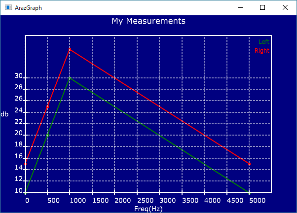
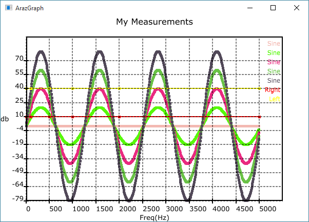

# ArazGraph
### Author: Ara Bedrossian
### Turned into a JUCE module by Maximilian Rest

This is a simple data plotter module for [JUCE](https://github.com/julianstorer/JUCE).

Provides 'ArazGraph.h' and 'ArazGraph.cpp' to plot multiple datasets.

## Requirements

Requires JUCE >4.0.0, might work with >3.0.0 as well.

## Example

```
void MainContentComponent::paint(Graphics& g)
{
	g.fillAll(Colour(0xff001F36));

	ArazGraph* graph = new ArazGraph(getLocalBounds(), "My Measurements", "Freq(Hz)", "db");

	ArazGraphDataset* leftEarData = new ArazGraphDataset("Left", Colours::green);
	leftEarData->append(new ArazGraphPoint(0, 10));
	leftEarData->append(new ArazGraphPoint(500, 20));
	leftEarData->append(new ArazGraphPoint(1000, 30));
	leftEarData->append(new ArazGraphPoint(5000, 10));
	graph->append(leftEarData);

	ArazGraphDataset* rightEarData = new ArazGraphDataset("Right", Colours::red);
	rightEarData->append(new ArazGraphPoint(0, 15));
	rightEarData->append(new ArazGraphPoint(500, 25));
	rightEarData->append(new ArazGraphPoint(1000, 35));
	rightEarData->append(new ArazGraphPoint(5000, 15));
	graph->append(rightEarData);

	graph->paint(g);

	delete graph;
}
```

## Screenshots




